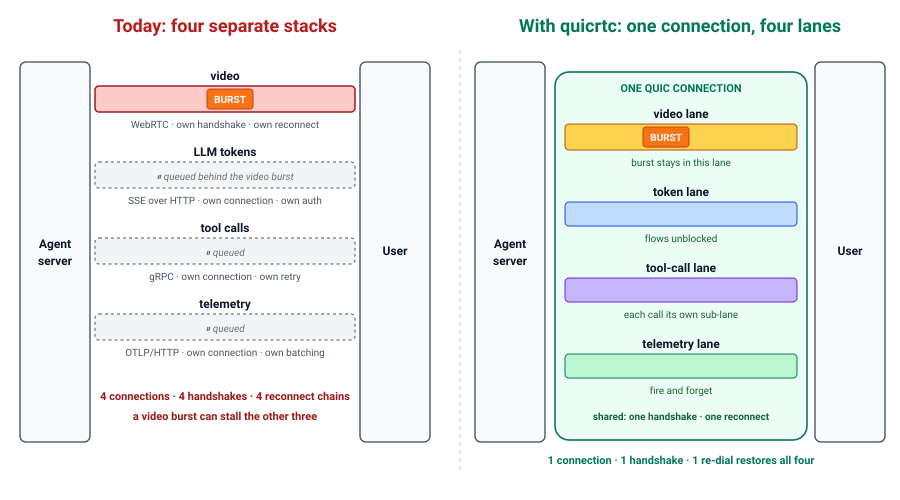
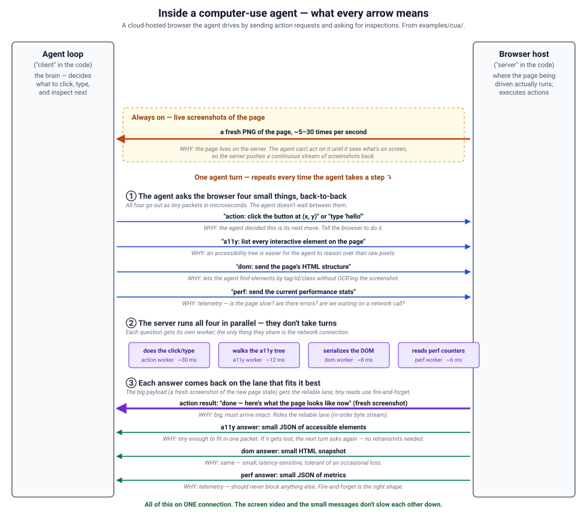
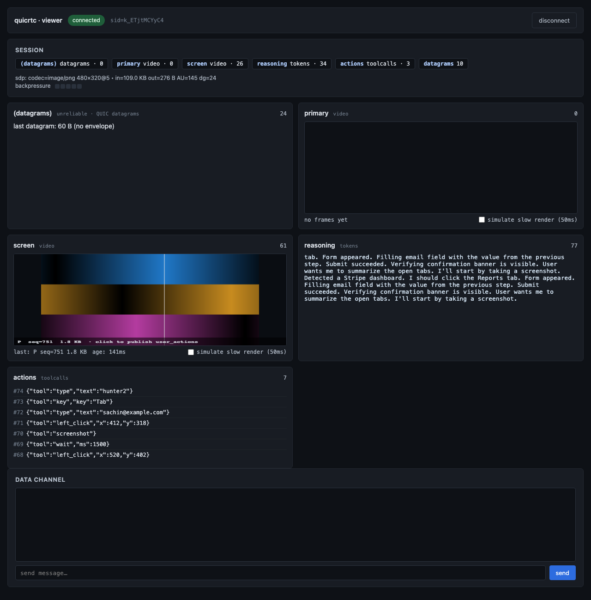

# quicrtc

[](https://github.com/sachinkesiraju/quicrtc/actions/workflows/test.yml)
[](https://pkg.go.dev/github.com/sachinkesiraju/quicrtc)
[](https://www.npmjs.com/package/quicrtc)
[](LICENSE)

**One QUIC/WebTransport connection that carries everything an AI agent sends to a user — screen video, LLM tokens, tool calls, telemetry — on separate lanes that don't block each other.**

<p align="center"></p>

**Built for** computer-use agents, voice/multimodal orchestration layers, and anything where a server pushes multiple kinds of data to one client and the standard answer is gluing together WebRTC + SSE + gRPC + OTLP.

Video recovers in one frame instead of one second. Tokens don't stall behind a video burst. Tool calls run concurrently. Telemetry bypasses the queue. Reconnect after a network change is one round-trip, not three.

## Inside one connection

One QUIC connection, four lanes that don't block each other. Continuous video on a dedicated lane; the per-turn agent requests run in parallel on their own lanes; small fire-and-forget snapshots ride QUIC datagrams.

<p align="center"></p>

Live in the browser: the built-in viewer ([`ts-sdk/examples/viewer/`](ts-sdk/examples/viewer/)) connected to the [`examples/agent_pubsub`](examples/agent_pubsub/) server.

<p align="center"></p>

## Features

- **One pipe, no glue.** A single QUIC connection replaces the four-protocol stack (WebRTC + SSE + gRPC + OTLP). One handshake, one auth, one reconnect path.
- **Lanes that don't block each other.** Each kind of traffic gets its own lane. A 60 Mbps screen burst doesn't stall the tokens.
- **Video recovers in one frame, not one second.** Receiver requests a fresh keyframe immediately on loss — ~33 ms of stutter instead of ~1–2 seconds.
- **Tiny browser footprint.** TypeScript SDK is ~20 KB minified / ~6 KB gzipped. The Go server is a single library, no sidecar.
- **Built-in 1-to-many fanout.** Native relay forwards bytes as-is between hops; no re-encoding at every viewer.
- **Session recording + multi-tenant auth.** `AttachRecorder` writes every AU to an append-only log for replay. `OnAnnounce` gates inbound track creation by tenant.

## Performance

Head-to-head: same workload, same machine, same network. Lower is better. Loopback rows use synthetic 50 ms RTT; WAN rows use two GCP VMs across US regions. [Full methodology](testing/benchmarks/METHODOLOGY.md).

| # | Workload | Baseline | quicrtc | Result |
|---|---|---|---|---|
| 1 | [Cold start: open 4 streams](testing/benchmarks/setup/setup_bench_test.go) | 4 protocols, serial handshakes: p50 **647 ms** | One QUIC handshake covers all four: p50 **167 ms** | **~4× faster** |
| 2 | [Reconnect after network drop](testing/benchmarks/resume/reattach_after_kill_test.go) | WebRTC + SSE + HTTPS reconnect in parallel: p50 **233 ms** | One re-dial: p50 **160 ms** | **~1.5× faster** |
| 3 | [Telemetry while video is busy](testing/benchmarks/telemetry/datagram_realquic_test.go) | Reliable QUIC stream + 60 Mbps video: mean **285 µs** | Fire-and-forget datagrams: mean **175 µs** | **~1.6× lower latency** |
| 4 | [LLM tokens during a 60 Mbps screen burst — real WAN](testing/wan_bench/client.go) | pion shared WebRTC connection: p50 **41 ms**, p99 **378 ms** | quicrtc per-lane isolation: p50 **37 ms**, p99 **47 ms** | **~8× faster at the painful tail** |
| 5 | [Computer-use action→DOM RTT — real WAN](testing/wan_bench/computer_use.go) | TCP-multiplexed channels: p50 **63 ms**, p99 **157 ms** | quicrtc: p50 **65 ms**, p99 **80 ms** | **~2× faster at the painful tail** |
| 6 | [1-to-many broadcast (4 viewers)](testing/benchmarks/fanout/live_broadcast_test.go) | pion SFU re-encoded per hop: worst viewer p99 **8.42 ms** | Native relay forwards bytes as-is: worst viewer p99 **4.62 ms** | **~1.8× lower tail** |

Row 4 is the headline: tokens ride a separate lane, so a 60 Mbps video burst doesn't drag their tail.

**Where it doesn't win:** a single token stream alone on a clean connection (HTTP/2 SSE is ~20% faster at the median — lanes only pay off when you have multiple things to keep apart), browser-to-browser (use WebRTC), conversational voice that needs the browser's audio cleanup (use WebRTC), native iOS/Android (no port yet).

## Install

```bash
go get github.com/sachinkesiraju/quicrtc@latest   # Go server / client
npm install quicrtc                                # TypeScript browser SDK
```

Requires Go 1.26+, Node 18+, and a browser with WebTransport (Chrome/Edge 114+, Safari 18.2+, Firefox with flag).

Deploying? See [`docs/DEPLOYMENT.md`](docs/DEPLOYMENT.md). Stuck? [`docs/TROUBLESHOOTING.md`](docs/TROUBLESHOOTING.md).

## Quick start

### Server (Go)

```go
import (
    "github.com/sachinkesiraju/quicrtc/server"
    "github.com/sachinkesiraju/quicrtc/pubsub"
    "github.com/sachinkesiraju/quicrtc/track"
    "github.com/sachinkesiraju/quicrtc/wire"
)

srv, _ := server.New(server.Config{
    Addr: ":4433",
    SDP:  wire.SDP{Codec: "avc1.42E01F", Width: 1280, Height: 720, FPS: 30},
})

videoPub := srv.AddTrackSpec(server.TrackSpec{Name: "screen",    Kind: track.KindVideo})
tokenPub := srv.AddTrackSpec(server.TrackSpec{Name: "reasoning", Kind: track.KindTokens})
telePub  := srv.AddTrackSpec(server.TrackSpec{Name: "telemetry", Kind: track.KindTelemetry})

go srv.ListenAndServe(ctx)

for token := range llm.Tokens() {
    tokenPub.Publish(ctx, pubsub.AccessUnit{Bytes: token.Bytes, Keyframe: true})
}
```

Full runnable example: [`examples/publisher/`](examples/publisher/).

### Client (TypeScript)

```typescript
import { QuicRTCClient, decodeDatagram } from 'quicrtc';

const client = new QuicRTCClient();
await client.connect('https://your-server/wt', { slug: 'auth-token' });

client.onTrack('screen', (au) => {
  // decode with WebCodecs, render to <canvas>
});

const auTokens = await client.recvOn('reasoning');
console.log(new TextDecoder().decode(auTokens.bytes));
```

Browser viewer that exercises every lane: [`ts-sdk/examples/viewer/`](ts-sdk/examples/viewer/).

## Examples

- [`examples/publisher`](examples/publisher/) + [`examples/subscriber`](examples/subscriber/): minimal 1:1 publish/subscribe.
- [`examples/agent_pubsub`](examples/agent_pubsub/): four channels on one connection.
- [`examples/cua`](examples/cua/): computer-use agent with naive vs. multistream dispatch (a measured benchmark; mocks the browser).
- [`examples/cua-live`](examples/cua-live/): a *real* computer-use agent loop streaming screen / reasoning / tool-calls / telemetry to the viewer — `-fake` runs anywhere with zero setup, `-live` drives a real Chromium via Claude.
- [`examples/relay`](examples/relay/): 1:N broadcast through the native relay.
- [`examples/replay`](examples/replay/): replay and inspect a recorded session — a frame-aligned timeline of what the agent saw, reasoned, and did, plus an [interactive browser scrubber](examples/replay/viewer/).
- [`ts-sdk/examples/compare`](ts-sdk/examples/compare/): browser side-by-side — watch tokens freeze on a naive single stream while they keep flowing on quicrtc lanes.

## FAQ

**How does this compare to WebRTC / WebSockets?** WebSockets carry one queue, so multiple kinds of traffic stall each other. WebRTC is built for browser-to-browser and for voice/video where the browser handles audio cleanup; it's the right tool for Zoom or conversational voice. quicrtc is for one-server-pushing-many-kinds-of-data-to-a-client on a single connection.

**Is this production-ready?** Wire format is stable, cross-language tested, and benchmark numbers reproduce on real GCP VMs. It's a solo open-source project with no known third-party deployments — vet it the way you'd vet any new dependency.

**How does this compare to Media over QUIC (MoQ)?** Not MoQ-compatible. The stream-per-GOP wire pattern is inspired by MoQ-lite's group-as-stream model, but quicrtc is optimized for AI-agent traffic shape rather than MoQ's "replace HLS and WebRTC" scope. Use MoQ if you need MoQ interop.

**Browser-to-browser?** No — browsers can only initiate WebTransport, not accept it. Use WebRTC.

## Status

**v1.0.2.** Wire format stable across Go and TypeScript; v0.1 clients connect to v1.0.2 servers unchanged. Public Go API committed. Missing: native iOS/Android, known production deployments.

Architecture: [`docs/architecture.md`](docs/architecture.md). Wire spec: [`docs/SPEC.MD`](docs/SPEC.MD). Auth: [`docs/auth.md`](docs/auth.md). Release notes: [`docs/CHANGELOG.md`](docs/CHANGELOG.md). Issues: [GitHub Issues](https://github.com/sachinkesiraju/quicrtc/issues).

## Contributing & License

PRs welcome — see [`docs/CONTRIBUTING.md`](docs/CONTRIBUTING.md). Security issues: [`docs/SECURITY.md`](docs/SECURITY.md). Apache 2.0; see [`LICENSE`](LICENSE).

## Acknowledgments

Stream-per-GOP pattern inspired by IETF [MoQ-lite](https://datatracker.ietf.org/doc/draft-ietf-moq-transport/) (not wire-compatible). Built on [`quic-go`](https://github.com/quic-go/quic-go); WebRTC baselines use [pion](https://github.com/pion/webrtc).
