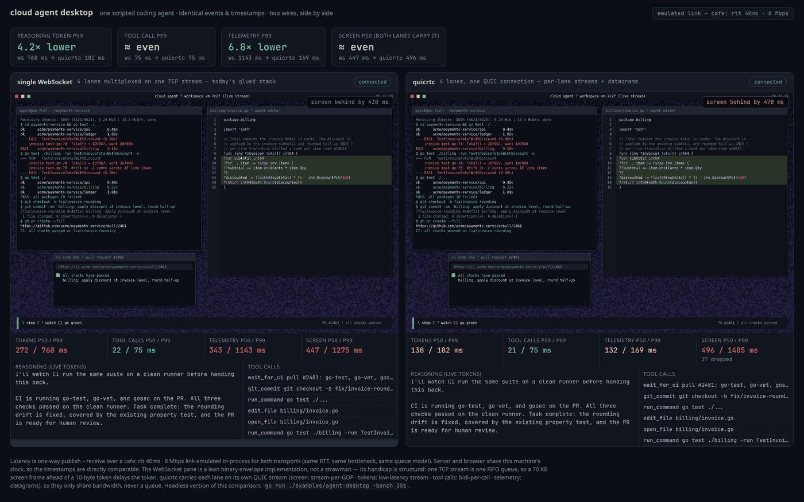

# quicrtc

[](https://github.com/sachinkesiraju/quicrtc/actions/workflows/test.yml)
[](https://pkg.go.dev/github.com/sachinkesiraju/quicrtc)
[](https://www.npmjs.com/package/quicrtc)
[](LICENSE)

**Real-time transport for AI agent sessions over QUIC/WebTransport.**

quicrtc is a Go library and TypeScript SDK designed for the traffic shape that modern AI agents produce. It streams video, low-latency tokens, RPC-shaped tool calls, and fire-and-forget telemetry over a single QUIC/WebTransport connection.

Most agent products today glue together separate transports — SSE for LLM tokens, WebRTC for video, gRPC for tool calls, OTLP for telemetry — each with its own connection lifecycle, reconnect story, and head-of-line (HOL) behavior. quicrtc folds that stack into a single QUIC connection, and each kind of traffic gets routed the way it needs.

All four tracks share one QUIC connection, so reconnecting after a drop is a single handshake instead of three — and the session resumes with per-track replay of AUs that were in flight when the connection died.

<p align="center"></p>

A track's `Kind` picks its wire shape. Video bursts and the token stream sit on separate QUIC streams and never share a send queue.

| | Glued stack | quicrtc | Why it matters |
|---|---|---|---|
| 🟦 **Video** | WebRTC | one stream per group-of-pictures | a dropped frame recovers in **~33 ms**, not ~1–2 s |
| 🟩 **Tokens** | SSE | a low-latency stream | keep flowing **during** a video burst |
| 🟧 **Tool calls** | gRPC | a bidirectional stream per call | calls run in **parallel** |
| ⬜ **Telemetry** | OTLP | QUIC datagrams | metrics **skip the queue** entirely |
| **Connections** | 4 | **1** | one to open, secure, and watch |
| **Handshake + auth** | 4× | **1×** | one login covers every lane |
| **Reconnect after a drop** | 3 round-trips | **1** | one handshake + session resume with replay |
| **1-to-many fanout** | SFU re-encodes per hop | **native relay** | forwards bytes as-is, no re-encode |
| **Browser client** | heavy | **~18 KB gzipped** | zero dependencies |
| **Recording / replay** | a 5th system | **built in** | on one capture clock |

## See it

One command runs the flagship demo — a cloud coding agent's desktop (screen, reasoning tokens, tool calls, telemetry) streamed to your browser over quicrtc and over a single WebSocket **side by side**, through the same emulated café-wifi link, with live per-lane latency:

```bash
go run ./examples/agent-desktop
# open http://127.0.0.1:8420
```

<p align="center"></p>

The screen lane (~6 Mbps of desktop frames) stays roughly even — both transports carry the same bulk bytes through the same bottleneck. The agent's *interactive* lanes are where the architecture shows: reasoning tokens, tool calls, and telemetry stop queueing behind the screen share and arrive **3–10× faster at p99** ([details + headless bench mode](examples/agent-desktop/)).

## Performance

Same workload, same machine, same network, baseline and quicrtc back to back. Lower is better. Loopback rows use a synthetic 50 ms RTT; WAN rows run on two GCP VMs across US regions (~64 ms RTT). [Full methodology](testing/benchmarks/METHODOLOGY.md).

| # | Workload | Baseline | quicrtc | Result |
|---|---|---|---|---|
| 1 | [Cold start: open 4 streams](testing/benchmarks/setup/setup_bench_test.go) | 4 protocols, serial handshakes: p50 **647 ms** | one QUIC handshake covers all four: p50 **167 ms** | **~4× faster** |
| 2 | [Reconnect after network drop](testing/benchmarks/resume/reattach_after_kill_test.go) | WebRTC + SSE + HTTPS reconnect: p50 **233 ms** | one re-dial: p50 **160 ms** | **~1.5× faster** |
| 3 | [Telemetry while video is busy](testing/benchmarks/telemetry/datagram_realquic_test.go) | reliable QUIC stream + 60 Mbps video: mean **285 µs** | fire-and-forget datagrams: mean **175 µs** | **~1.6× lower latency** |
| 4 | [LLM tokens during a 60 Mbps screen burst — real WAN](testing/wan_bench/client.go) | pion shared WebRTC connection: p50 **41 ms**, p99 **378 ms** | per-lane isolation: p50 **37 ms**, p99 **47 ms** | **~8× faster at the tail** |
| 5 | [Computer-use action→DOM RTT — real WAN](testing/wan_bench/computer_use.go) | TCP-multiplexed channels: p50 **63 ms**, p99 **157 ms** | quicrtc: p50 **65 ms**, p99 **80 ms** | **~2× faster at the tail** |
| 6 | [1-to-many broadcast (4 viewers)](testing/benchmarks/fanout/live_broadcast_test.go) | pion SFU re-encoded per hop: worst viewer p99 **8.42 ms** | native relay: worst viewer p99 **4.62 ms** | **~1.8× lower tail** |

**Where it doesn't win:** a single token stream on a clean connection — HTTP/2 SSE beats it ~20% at the median, and one stream has nothing to isolate. Browser-to-browser (use WebRTC). Conversational voice that needs the browser's audio cleanup (use WebRTC). Native iOS/Android (no port yet).

## Install

```bash
go get github.com/sachinkesiraju/quicrtc@latest   # Go server / client
npm install quicrtc                                # TypeScript browser SDK
```

Requires Go 1.26+, Node 18+, and a browser with WebTransport (Chrome/Edge 114+, Safari 18.2+, Firefox with a flag).

## Quick start

**Server (Go)** — one publisher per kind:

```go
srv, _ := server.New(server.Config{
    Addr: ":4433",
    SDP:  wire.SDP{Codec: "avc1.42E01F", Width: 1280, Height: 720, FPS: 30},
})

videoPub := srv.AddTrackSpec(server.TrackSpec{Name: "screen",    Kind: track.KindVideo})
tokenPub := srv.AddTrackSpec(server.TrackSpec{Name: "reasoning", Kind: track.KindTokens})
telePub  := srv.AddTrackSpec(server.TrackSpec{Name: "telemetry", Kind: track.KindTelemetry})

go srv.ListenAndServe(ctx)

for token := range llm.Tokens() {
    tokenPub.Publish(ctx, pubsub.AccessUnit{Bytes: token.Bytes, Keyframe: true})
}
```

**Client (TypeScript)** — subscribe to the lanes you want:

```typescript
import { QuicRTCClient } from 'quicrtc';

const client = new QuicRTCClient();
await client.connect('https://your-server/wt', { slug: 'auth-token' });

client.onTrack('screen', (au) => { /* decode with WebCodecs, render to <canvas> */ });

const tokens = await client.recvOn('reasoning');
console.log(new TextDecoder().decode(tokens.bytes));
```

Runnable: [`examples/agent-desktop/`](examples/agent-desktop/) (the flagship side-by-side demo above), [`examples/publisher/`](examples/publisher/) (minimal server) and [`ts-sdk/examples/viewer/`](ts-sdk/examples/viewer/) (a browser viewer driving all four lanes at once). A real Claude computer-use loop lives in [`examples/cua-live/`](examples/cua-live/) (`go run . -fake`, zero setup); the native relay and a session-replay scrubber are in [`examples/`](examples/) and [`ts-sdk/examples/`](ts-sdk/examples/). Deploying? See [`docs/DEPLOYMENT.md`](docs/DEPLOYMENT.md). Stuck? [`docs/TROUBLESHOOTING.md`](docs/TROUBLESHOOTING.md).

## FAQ

**How is this different from WebRTC / WebSockets?** A WebSocket is one queue, so different kinds of traffic stall each other. WebRTC is built for browser-to-browser and for voice/video that needs the browser's audio cleanup — the right tool for Zoom or conversational voice. quicrtc is for one server pushing many kinds of data to a client on a single connection.

**Is it production-ready?** The wire format is stable, cross-language tested, and the benchmark numbers reproduce on real GCP VMs. For open deployments, set `MaxSessions`, `InboundRateLimit`, and a `Metrics` sink — the defaults are tuned for closed/trusted environments.

**Does this support browser p2p?** No — browsers can only initiate WebTransport, not accept it. Use WebRTC.

**How does it relate to Media over QUIC (MoQ)?** Not MoQ-compatible, by choice. quicrtc runs its own small wire format — a 17-byte feed frame, a datagram envelope, and a handful of control frames — with four delivery classes tuned to agent traffic. It borrows MoQ-lite's group-as-stream idea for video but skips MoQT itself: that object-and-catalog model is built for media delivery at scale and doesn't fit RPC-shaped tool calls or datagram telemetry.

## Contributing & license

PRs welcome — see [CONTRIBUTING](docs/CONTRIBUTING.md). Security issues: [SECURITY](docs/SECURITY.md). Apache 2.0; see [`LICENSE`](LICENSE).

Docs: [architecture](docs/architecture.md) · [wire spec](docs/SPEC.MD) · [auth](docs/auth.md) · [changelog](docs/CHANGELOG.md) · [issues](https://github.com/sachinkesiraju/quicrtc/issues)

Stream-per-GOP pattern inspired by IETF [MoQ-lite](https://datatracker.ietf.org/doc/draft-ietf-moq-transport/) (not wire-compatible). Built on [`quic-go`](https://github.com/quic-go/quic-go); WebRTC baselines use [pion](https://github.com/pion/webrtc).
