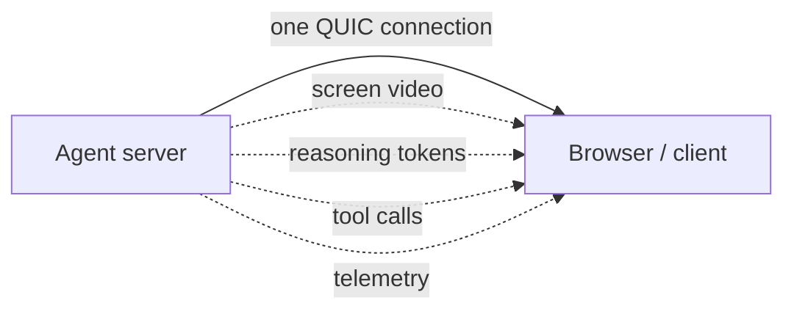

# quicrtc

[](https://github.com/sachinkesiraju/quicrtc/actions/workflows/test.yml)
[](https://pkg.go.dev/github.com/sachinkesiraju/quicrtc)
[](https://goreportcard.com/report/github.com/sachinkesiraju/quicrtc)
[](LICENSE)

**Real-time transport for AI agent sessions over QUIC/WebTransport.**

quicrtc is a Go library and TypeScript SDK designed for the traffic shape that modern AI agents produce.
It streams video, low-latency tokens, RPC-shaped tool calls, and fire-and-forget telemetry over a single
QUIC/WebTransport connection, giving each data type custom delivery semantics.

Most agent products today glue together separate transports — SSE
for LLM tokens, WebRTC for video, gRPC for tool calls, OTLP for
telemetry — each with its own connection lifecycle, reconnect
story, and head-of-line (HOL) behavior.

quicrtc collapses them into one connection with delivery classes
tuned to each workload:

- **Tokens** — persistent low-latency stream. No per-token stream
  churn, low inter-arrival jitter.
- **Video** — one uni stream per GOP plus subscriber-driven keyframe
  request. Loss recovery in ~33 ms instead of up to one GOP duration.
- **Tool calls** — fresh bidi stream per call. One stalled call
  doesn't HOL-block the others, even under packet loss.
- **Telemetry** — QUIC datagrams that bypass stream flow control, so
  they don't queue behind video bursts.

All four share QUIC's 0-RTT resume and connection migration, so
reconnecting restores every workload in one round-trip instead of
three handshakes.

Perfect for computer-use agents, coding assistants, and realtime voice agents.



## Contents

- [Features](#features)
- [Status](#status)
- [Performance](#performance)
- [Prerequisites](#prerequisites)
- [Quick start](#quick-start)
- [Authentication](#authentication)
- [Layout](#layout)
- [Examples](#examples)
- [Running the tests](#running-the-tests)
- [FAQ: quicrtc vs. WebRTC vs. WebSockets](#faq-quicrtc-vs-webrtc-vs-websockets)
- [Contributing](#contributing)
- [License](#license)
- [Acknowledgments](#acknowledgments)

## Features

- **One QUIC connection** replaces the SSE + WebRTC + gRPC + OTLP
  glue an agent product normally maintains.
- **Per-track delivery classes** eliminate head-of-line (HOL)
  blocking between tracks: tokens, video, tool calls, and telemetry
  each get the stream shape their workload wants.
- **Subscriber-driven keyframe recovery** cuts visible-stutter time
  from up to one GOP to ~one frame interval (~33 ms at 30 fps).
- **0-RTT resume and connection migration** restore every workload
  in one round-trip after a network change.
- **Wire-compatible** Go server and ~20 KB TypeScript browser SDK.
- **Native-wire relay** for 1:N fan-out — same protocol end-to-end;
  subscribers can't tell they're talking to a relay.


## Status

Pre-1.0. The wire format is stable across the Go and TypeScript
clients; the public API may shift before v1.0. See
[`docs/roadmap.md`](docs/roadmap.md) for what's planned.

## Performance

Real numbers from the benchmark suite in the repo, on Apple Silicon
loopback. Each test runs against the current best incumbent practice
for that workload — a legacy quicrtc path, pion's canonical pattern,
or the standard alternative. Every row maps to a test you can run.

| Workload                                            | Baseline architecture + result                                                                  | quicrtc architecture + result                                                                              | Test                              |
|-----------------------------------------------------|-------------------------------------------------------------------------------------------------|------------------------------------------------------------------------------------------------------------|-----------------------------------|
| Token stream jitter (2000 AUs @ 1.25 ms)            | Legacy `StreamGOP`: **new uni QUIC stream per AU** — 2000 opens, stddev 37 µs                   | `StreamLowLatency`: **one persistent uni stream + pooled encoder** — **1 open**, **stddev 32 µs**          | `TestTokenPumpJitterComparison`   |
| Telemetry during concurrent video burst             | **Telemetry on a reliable uni stream** alongside video — mean 284 µs, p99 810 µs                | **Raw QUIC datagrams** (bypass per-stream flow control) — **mean 170 µs (1.7×)**, **p99 407 µs (2.0×)**    | `TestDatagramVsStreamContention`  |
| 8 parallel tool calls, 1 stalled 200 ms             | **All 8 calls serialized on one shared bidi stream** — median 264 ms (HOL-blocked)              | `BidiPerCall`: **fresh bidi stream per call**, concurrent — **median 12 ms (22×)**, p99 12 ms vs. 289 ms   | `TestBidiPerCallIsolation`        |
| Video recovery after loss (30 fps, 2 s GOP)         | **Subscriber waits passively** for the next natural keyframe — mean 2.02 s                      | **`Client.RequestKeyframe()` → `OnKeyframeRequest` → encoder flush** — **mean 33 ms (61×)**                | `TestKeyframeRecoveryComparison`  |
| Tokens during video burst, vs. WebRTC               | **pion 1 `RTCPeerConnection` + 2 `RTCDataChannel`s**, one SCTP-over-DTLS assoc. — token p99 1.47 ms | **1 quicrtc session, 2 QUIC streams** (DataChannel + AU pipeline) — **token p99 304 µs (4.8×)**            | `TestMultimodalIsolation*`        |
| 1:N broadcast, N=4 subscribers, 50 KB frames        | **pion-based SFU**: 1+N PCs, per-sub data channel forwarded by goroutine — worst-sub p99 8.5 ms | **`relay.Relay`**: server + upstream-client, splice-forward AUs (no re-encode) — **worst-sub p99 4.8 ms (1.8×)** | `TestLiveBroadcastQuicrtcRelay`   |
| High-priority work under scheduler contention       | **FIFO write ordering**, no priority awareness — high-priority p99 13.3 ms                      | **`feed.Scheduler`** with weighted preemption — **high-priority p99 6.6 ms (2.0×)**                        | `TestSchedulerPriorityPreemption` |
| Closed-loop computer-use, 4 concurrent tracks       | **WebSocket + JSON-RPC** (ACP shape): all 4 channels share **one TCP connection** — 500 KB screen flood HOL-blocks tokens, actions, and dom_events at the TCP layer | **1 quicrtc session, 4 typed QUIC tracks** (screen 120 Mbps + tokens + actions + dom_events, each with its own delivery class) — token p99 335 µs, action→DOM RTT p99 979 µs, 100% delivery | `TestApp1ComputerUseClosedLoop`   |
| Relay overhead (native vs. one-hop relayed)         | **Subscriber connects directly to publisher** — mean 106 µs                                     | **Same subscriber through `relay.Relay`** — mean 213 µs (**+107 µs/AU, +197 µs p99**)                      | `TestRelayOverhead`               |

**Where this shines**  
These wins line up against four structural failure modes of the usual SSE + WebRTC + gRPC + OTLP glue: cross-track head-of-line blocking under multi-stream load, one stalled RPC freezing the rest, recovery from packet loss, and 1:N fan-out at the edge. Worst-case latencies in those scenarios collapse from seconds to tens of milliseconds (or milliseconds to hundreds of microseconds) — the table above has the specifics. Multi-modal agents, computer-use sessions, voice agents, 1:N broadcasts, and anything reconnecting on mobile all sit squarely in that profile.

**Where it doesn’t**  
If you’re just streaming a single LLM token stream over a clean, stable connection, plain SSE-over-HTTP/2 is still ~20% faster at the median (`TestTokenStreamingVsSSE`). That’s the one narrow case where the old-school approach has less overhead.

quicrtc is also not the right tool for browser-to-browser P2P (no server), native browser audio with AEC/NS/AGC, or native mobile apps that already ship libwebrtc. In those situations, standard WebRTC is still the better choice.

## Prerequisites

- Go 1.25 or later (1.26 also supported)
- Node 18+ for the TypeScript SDK
- A browser with WebTransport: Chrome / Edge 114+, Safari 26.4+, or
  Firefox with `network.webtransport.enabled` set

## Quick start

### Server (Go)

```go
import (
    "github.com/sachinkesiraju/quicrtc/server"
    "github.com/sachinkesiraju/quicrtc/pubsub"
    "github.com/sachinkesiraju/quicrtc/track"
    "github.com/sachinkesiraju/quicrtc/wire"
)

srv, _ := server.New(server.Config{
    Addr: ":4433",
    SDP:  wire.SDP{Codec: "avc1.42E01F", Width: 1280, Height: 720, FPS: 30},
    OnKeyframeRequest: func(sessID, trackName string) {
        encoder.ForceKeyframeOnNextFrame()
    },
})

// Kind selects the per-track delivery class.
videoPub := srv.AddTrackSpec(server.TrackSpec{Name: "screen",    Kind: track.KindVideo,     Priority: 4})
tokenPub := srv.AddTrackSpec(server.TrackSpec{Name: "reasoning", Kind: track.KindTokens,    Priority: 2})
telePub  := srv.AddTrackSpec(server.TrackSpec{Name: "telemetry", Kind: track.KindTelemetry, Priority: 7, TrackID: 0x42})

go srv.ListenAndServe(ctx)

for token := range llm.Tokens() {
    tokenPub.Publish(ctx, pubsub.AccessUnit{
        Bytes: token.Bytes, Keyframe: true,
    })
}
```

For a full runnable program with cert generation and graceful
shutdown, see [`examples/publisher/`](examples/publisher/).

### Client (TypeScript)

```bash
npm install quicrtc
```

```typescript
import { QuicRTCClient, decodeDatagram } from 'quicrtc';

const client = new QuicRTCClient();
await client.connect('https://your-server/wt', {
  slug: 'auth-token',                     // shared secret or JWT — see docs/auth.md
  certHash: 'base64url-sha256-der-hash',  // for self-signed dev certs only
});

// Video, with subscriber-driven keyframe recovery on detected loss.
let lastSeq = -1;
client.onTrack('screen', (au) => {
  if (lastSeq >= 0 && au.seq > lastSeq + 1 && !au.keyframe) {
    void client.requestKeyframe('screen');
  }
  lastSeq = au.seq;
  // decode with WebCodecs, render to <canvas>
});

// Tokens.
const auTokens = await client.recvOn('reasoning');
console.log(new TextDecoder().decode(auTokens.bytes));

// Telemetry datagrams.
const raw = await client.receiveDatagram();
if (raw) {
  const { trackId, seq, payload } = decodeDatagram(raw);
}
```

A framework-free browser viewer that exercises every track kind
lives in [`ts-sdk/examples/viewer/`](ts-sdk/examples/viewer/) — point
it at any quicrtc server and the right panels light up.

## Authentication

Subscribers authenticate at the HELLO handshake with an opaque
credential the server validates. Two modes:

- **Single-tenant (shared slug):** `server.Config.Slug` — a shared
  secret echoed by every subscriber. Constant-time compared.
  Auto-generated 128-bit base64url if unset.
- **Multi-tenant (validator):** `server.Config.AuthValidator
  func(credential string) (tenant string, err error)` — receives
  the raw HELLO field (stuff a JWT, bearer token, anything),
  returns a tenant scope that namespaces session resume across
  tenants.

Server identity is verified by either a standard CA chain (production
TLS cert via `Config.CertBundle` or `Config.CertGetter` for
hot-reloadable Let's Encrypt) or SHA-256 cert-hash TOFU pinning
(self-signed dev certs — the hash is part of the share-link
fragment).

See [`docs/auth.md`](docs/auth.md) for the full guide, threat model,
and what the auth layer does *not* protect against.

## Layout

```
Library packages (the public Go API):
  wire/  track/  feed/  pubsub/  session/  server/  client/
  peerconnection/  relay/  datachannel/  cert/  metrics/  transport/

Everything else:
  benchmarks/         end-to-end perf suite (topic subpackages)
  examples/           runnable Go publisher/subscriber/relay demos
  integration_test/   cross-package E2E tests
  ts-sdk/             TypeScript browser client + browser viewer
  docs/               architecture, roadmap, spec, auth model
```

### Library packages

- **`wire/`** — frame and datagram wire formats. Control-stream framing, feed-stream framing (17-byte header), datagram envelope (4-byte header).
- **`track/`** — `LocalTrack` / `RemoteTrack` definitions, `Kind` and `DeliveryClass` enums, kind→class defaults.
- **`feed/`** — the pump layer. Routes each track to its `DeliveryClass`-specific implementation: `StreamGOP`, `StreamLowLatency`, `BidiPerCall`, or `DatagramOrStream`. Includes the app-layer priority scheduler.
- **`pubsub/`** — broadcaster with per-receiver bounded queue and keyframe-aware drop policy.
- **`session/`** — per-session state machine (handshake, control-frame routing, track attach, resume).
- **`server/`** — public publisher-side API (`Server`, `Publisher`, `SessionHandle`).
- **`client/`** — public subscriber-side API (`Client.Dial`, `Recv`, `RequestKeyframe`, `SendDatagram`).
- **`peerconnection/`** — high-level wrapper combining server/client into a `PeerConnection` ergonomics layer.
- **`relay/`** — native relay (upstream-subscribe, downstream-republish) for 1:N fan-out.
- **`datachannel/`** — bidi control-stream messaging primitive (built on the session's control stream, exposed as a `*datachannel.Channel`).
- **`cert/`** — self-signed dev cert generator, TLS bundle helpers, hot-reloadable cert source.
- **`metrics/`** — internal counters and probes used by the pump and broadcaster.
- **`transport/`** — `Sender` / `Receiver` interfaces shared across native and relay roles.

### Benchmarks (`benchmarks/`)

Topic subpackages, each runnable in isolation:

- `agent/` — closed-loop computer-use latency (action → DOM event RTT)
- `video/` — keyframe-recovery comparison (subscriber-driven request vs. natural GOP)
- `tokens/` — quicrtc `StreamLowLatency` vs. SSE-over-HTTP/2
- `telemetry/` — datagram vs. reliable stream under video contention
- `multimodal/` — token + video stream isolation (vs. pion shared-PC)
- `fanout/` — 1:N broadcast (live broadcast SFU comparison + relay overhead)
- `resume/` — quicrtc resume vs. WebRTC ICE-restart / full-reconnect
- `network/` — RTT × loss grid sweep across the other workloads
- `internal/loadgen/` — shared harness (Pair, NetCond, payload codec, stats)
- `browser/` — Chrome-driver tests (separate Go submodule)

## Examples

Self-contained runnable examples live in [`examples/`](examples/),
arranged in reading order:

- [`examples/publisher`](examples/publisher) + [`examples/subscriber`](examples/subscriber) — minimal 1:1 publish/subscribe over the raw `server` + `client` APIs.
- [`examples/datachannel`](examples/datachannel) — bidirectional control-stream messaging.
- [`examples/agent_pubsub`](examples/agent_pubsub) — four channels (screen, reasoning, actions, telemetry) on one QUIC connection.
- [`examples/cua`](examples/cua) — computer-use agent with naive vs. multistream dispatch, a `-stress` preset, and a `deploy-vm.sh` for WAN testing.
- [`examples/relay`](examples/relay) — 1:N broadcast through the native relay.
- [`ts-sdk/examples/viewer/`](ts-sdk/examples/viewer/) — framework-free browser viewer that adapts to any announced track kind.

## Running the tests

```bash
go test ./...                                # library tests
go test -race ./feed ./wire ./session ./track ./pubsub
go test -v -p 1 ./benchmarks/... -timeout=600s    # end-to-end benchmarks
                                              # -p 1 keeps heavy real-QUIC
                                              # packages from competing for CPU
cd ts-sdk && npm test                         # TypeScript wire round-trip tests
cd ts-sdk && npm run bench                    # TypeScript wire micro-benchmark
```

## FAQ: quicrtc vs. WebRTC vs. WebSockets

**Use WebSockets when** the workload is a single bidirectional
message stream — chat, simple server push, a control plane. Wide
browser support, minimal setup. Trade-offs: head-of-line blocking
inside the one TCP stream once you try to multiplex multiple traffic
shapes, and reconnects are full TCP + TLS + WebSocket handshakes.

**Use WebRTC when** you need browser↔browser P2P without a server,
browser-native audio processing (AEC / NS / AGC via `getUserMedia`),
or native iOS / Android apps that already ship libwebrtc. The mature
SFU ecosystem (LiveKit, Daily, Mediasoup) is production-grade for
multi-party video conferencing.

**Use quicrtc when** the traffic is server-originated and
multi-modal: video, tokens, tool-call events, and telemetry flowing
concurrently from one AI pipeline to clients. Per-track QUIC streams
eliminate cross-track HOL blocking. Setup latency is ~10× faster
than WebRTC's ICE + DTLS handshake (~6 ms vs. ~50 ms on loopback),
and 0-RTT resume + connection migration restore every workload in
one round-trip on a network change. quicrtc also doesn't gate
codecs, so neural codecs and other novel pipelines work as opaque
AccessUnits.

See [`docs/architecture.md`](docs/architecture.md) for the full
positioning and [`benchmarks/`](benchmarks/) for head-to-head numbers
across the three.

## Contributing

PRs welcome. See [`CONTRIBUTING.md`](CONTRIBUTING.md) for dev setup,
test conventions, wire-format guarantees, and PR norms. Security
issues: see [`SECURITY.md`](SECURITY.md).

## License

Apache License 2.0 — see [`LICENSE`](LICENSE) for the full text and
[`NOTICE`](NOTICE) for attribution.

## Acknowledgments

The stream-per-GOP pattern is inspired by IETF moq-lite's
group-as-stream model. quicrtc is **not** wire-compatible with MoQ;
see [`docs/spec.md`](docs/spec.md) for the wire format.
