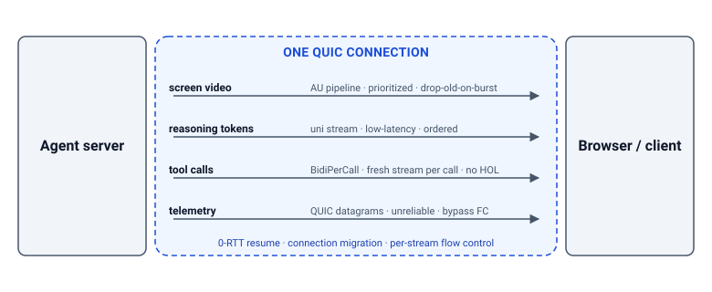

# quicrtc

[](https://github.com/sachinkesiraju/quicrtc/actions/workflows/test.yml)
[](https://pkg.go.dev/github.com/sachinkesiraju/quicrtc)
[](https://goreportcard.com/report/github.com/sachinkesiraju/quicrtc)
[](https://www.npmjs.com/package/quicrtc)
[](LICENSE)

**Real-time transport for AI agent sessions over QUIC/WebTransport.**

quicrtc is a Go library and TypeScript SDK designed for the traffic
shape that modern AI agents produce. It streams video, low-latency
tokens, RPC-shaped tool calls, and fire-and-forget telemetry over a
single QUIC/WebTransport connection.

Most agent products today glue together separate transports — SSE for LLM tokens, WebRTC for video, gRPC for tool calls, OTLP for telemetry — each with its own connection lifecycle, reconnect story, and head-of-line (HOL) behavior. quicrtc folds that stack into a single QUIC connection, and each kind of traffic gets routed the way it needs: video recovers in one frame instead of waiting two seconds, tokens stream without getting stuck behind a video burst, tool calls run concurrently without blocking each other, and telemetry bypasses the queue entirely.

All four tracks share QUIC's 0-RTT resume and connection migration,
so reconnecting restores every workload in one round-trip instead
of three handshakes.

Built for computer-use agents, coding assistants, realtime voice
agents, and workloads where a server pushes multiple kinds of
data to a client at once.

<p align="center"></p>

## Contents

- [Features](#features)
- [Performance](#performance)
- [Prerequisites](#prerequisites)
- [Quick start](#quick-start)
- [Authentication](#authentication)
- [Library packages](#library-packages)
- [Testing](#testing)
- [Examples](#examples)
- [Running the tests](#running-the-tests)
- [FAQ: quicrtc vs. WebRTC vs. WebSockets](#faq-quicrtc-vs-webrtc-vs-websockets)
- [Status](#status)
- [Contributing](#contributing)
- [License](#license)
- [Acknowledgments](#acknowledgments)

## Features

- **One QUIC connection** replaces the SSE + WebRTC + gRPC + OTLP
  glue an agent product normally maintains.
- **Per-track delivery classes** eliminate head-of-line (HOL)
  blocking between tracks: tokens, video, tool calls, and telemetry
  each get the stream shape their workload wants.
- **Subscriber-driven keyframe recovery** cuts visible-stutter time
  from up to one GOP to ~one frame interval (~33 ms at 30 fps).
- **0-RTT resume and connection migration** restore every workload
  in one round-trip after a network change.
- **Wire-compatible** Go server and TypeScript browser SDK (~20 KB
  minified / ~6 KB gzipped via `esbuild --bundle --minify`).
- **Native-wire relay** for 1:N fan-out — same protocol end-to-end;
  subscribers can't tell they're talking to a relay.


## Performance

Real numbers from the benchmark suite in the repo, run on Apple Silicon loopback. Each row's baseline is the current incumbent practice for that workload. WAN workload run on two GCP VMs (~50 ms RTT) via [`testing/wan_bench`](testing/wan_bench/). To reproduce: `go test -v -p 1 -run TestName ./testing/benchmarks/...`.

| Workload | Baseline | quicrtc |
|---|---|---|
| [Cold-start setup (vs. WebRTC)](testing/benchmarks/resume/resume_bench_test.go) | Full PeerConnection + ICE candidate gathering + DTLS — mean **138 ms** | TLS 1.3 + HELLO in a QUIC 1-RTT handshake — mean **0.94 ms** — **147×** by skipping ICE/DTLS entirely |
| [Tokens during video burst (vs. WebRTC)](testing/benchmarks/multimodal/multistream_isolation_test.go) | pion: 2 `RTCDataChannel`s sharing one SCTP-over-DTLS association — token p99 **1.96 ms** | 2 independent QUIC streams (DataChannel + AU pipeline) — token p99 **365 µs** — **5.4×** because per-stream flow control prevents the video burst from HOL-blocking tokens |
| [8 tool calls, 1 stalled 200 ms](feed/bidi_bench_test.go) | All 8 calls serialized on one shared bidi stream — median **251 ms** | `BidiPerCall` — fresh bidi stream per call, dispatched concurrently — median **13 ms** — **20×** because the stalled call no longer head-of-line-blocks the other seven |
| [Video recovery after packet loss (2 s GOP)](testing/benchmarks/video/keyframe_recovery_test.go) | Subscriber waits passively for the next natural keyframe — mean **2.03 s** | Subscriber-driven `Client.RequestKeyframe()` → publisher encoder flush — mean **33 ms** — **62×** by closing the loop instead of waiting a GOP |
| [Telemetry during video burst](testing/benchmarks/telemetry/datagram_realquic_test.go) | Telemetry on a reliable QUIC uni stream alongside video — mean **285 µs** | Raw QUIC datagrams with a 4-byte envelope — mean **175 µs** — **1.6× lower mean** by bypassing per-stream flow control and retransmits (p99 is noisy on loopback) |
| [Wi-Fi → cellular handoff (vs. WebRTC)](testing/benchmarks/resume/resume_bench_test.go) | WebRTC ICE restart (production-recommended pattern) — mean **79 ms** | QUIC 0-RTT session resume on the existing connection ID — mean **0.89 ms** — **88×** because no rehandshake / no new ICE round-trips |
| [WAN multi-stream (50 ms RTT)](testing/wan_bench/) | pion WebRTC, screen burst + 200 tok/s on one PeerConnection — token p99 **378 ms** | One quicrtc session, per-track delivery classes — token p99 **47 ms** — **8.0×** because the screen burst stays in its own QUIC stream's flow-control window |
| [1:N broadcast to 4 subscribers](testing/benchmarks/fanout/live_broadcast_test.go) | pion SFU: 1+N PeerConnections, per-sub data channel, DTLS+SCTP repack per hop — worst-sub p99 **8.42 ms** | Native relay: splice-forward QUIC stream messages, no re-encode — worst-sub p99 **4.62 ms** — **1.8×** by skipping the per-hop DTLS+SCTP repack |

> **⚠️** Loopback results vary in the real world with RTT, loss, and bandwidth. See [methodology](testing/benchmarks/METHODOLOGY.md).

**Where quicrtc wins** — workloads with multiple traffic shapes on one connection, where the structural advantage shows up:

- **Multi-modal AI traffic** — video + tokens + tool calls + telemetry from one server to clients. Each track gets its own QUIC stream with its own flow-control window, so a video burst can't HOL-block tokens. Closed-loop computer-use (60 Mbps screen + 200 tok/s + 100 actions/s + dom_events on one session) holds token p99 under **5 ms** and action→DOM RTT p99 under **10 ms** with 100% delivery — see [`testing/benchmarks/agent/computer_use_test.go`](testing/benchmarks/agent/computer_use_test.go) for the asserted thresholds (representative run: 475 µs / 966 µs on macOS loopback).
- **Stalled tool calls** — `BidiPerCall` opens a fresh bidi stream per call, so one slow call doesn't block the other seven (20× median speedup vs shared-stream serial).
- **Packet-loss recovery** — subscriber-driven `RequestKeyframe()` flushes a fresh GOP in one frame interval (~33 ms) instead of waiting up to 2 s for the next natural keyframe.
- **1:N fan-out** — native relay splice-forwards QUIC stream messages without re-encoding; SFU has to repack DTLS+SCTP at every hop.
- **Mobile / network changes** — 0-RTT resume restores every track in ~1 ms on a new connection ID; WebRTC has to re-run its ICE candidate-gathering handshake (~80 ms) every time the network path changes.

**Where quicrtc doesn't win:**

- **Single token stream on a clean connection** — SSE-over-HTTP/2 is ~20% faster at median for one ordered stream; per-stream isolation doesn't pay off if there's only one stream.
- **Browser↔browser P2P** — browser WebTransport is client-only (can't accept incoming connections), so two browsers can't talk directly. WebRTC's ICE peer mode is the right tool here.
- **Voice apps that need browser-native audio cleanup** — echo cancellation, noise suppression, and gain control are handled inside the browser when you capture mic input via `getUserMedia`, but only for WebRTC. quicrtc can't tap that audio pipeline from outside, so any voice app that relies on it stays on WebRTC.
- **Native iOS / Android apps** — both platforms ship WebRTC's native library (`libwebrtc`); quicrtc has no native mobile port yet. Apps embedding a webview can host the TypeScript SDK.

## Prerequisites

- Go 1.26+ (1.25+ works for core library; 1.26+ required for testing/benchmarks/browser)
- Node 18+ for the TypeScript SDK
- A browser with WebTransport: Chrome / Edge 114+, Safari 26.4+
  (Baseline since Mar 2026), or Firefox with
  `network.webtransport.enabled` set

## Quick start

### Server (Go)

```go
import (
    "github.com/sachinkesiraju/quicrtc/server"
    "github.com/sachinkesiraju/quicrtc/pubsub"
    "github.com/sachinkesiraju/quicrtc/track"
    "github.com/sachinkesiraju/quicrtc/wire"
)

srv, _ := server.New(server.Config{
    Addr: ":4433",
    SDP:  wire.SDP{Codec: "avc1.42E01F", Width: 1280, Height: 720, FPS: 30},
    OnKeyframeRequest: func(sessID, trackName string) {
        encoder.ForceKeyframeOnNextFrame()
    },
})

// Kind selects the per-track delivery class.
videoPub := srv.AddTrackSpec(server.TrackSpec{Name: "screen",    Kind: track.KindVideo,     Priority: 4})
tokenPub := srv.AddTrackSpec(server.TrackSpec{Name: "reasoning", Kind: track.KindTokens,    Priority: 2})
telePub  := srv.AddTrackSpec(server.TrackSpec{Name: "telemetry", Kind: track.KindTelemetry, Priority: 7, TrackID: 0x42})

go srv.ListenAndServe(ctx)

for token := range llm.Tokens() {
    tokenPub.Publish(ctx, pubsub.AccessUnit{
        Bytes: token.Bytes, Keyframe: true,
    })
}
```

For a full runnable program with cert generation and graceful
shutdown, see [`examples/publisher/`](examples/publisher/).

### Client (TypeScript)

```bash
npm install quicrtc
```

```typescript
import { QuicRTCClient, decodeDatagram } from 'quicrtc';

const client = new QuicRTCClient();
await client.connect('https://your-server/wt', {
  slug: 'auth-token',                     // shared secret or JWT — see docs/auth.md
  certHash: 'base64url-sha256-der-hash',  // for self-signed dev certs only
});

// Video, with subscriber-driven keyframe recovery on detected loss.
let lastSeq = -1;
client.onTrack('screen', (au) => {
  if (lastSeq >= 0 && au.seq > lastSeq + 1 && !au.keyframe) {
    void client.requestKeyframe('screen');
  }
  lastSeq = au.seq;
  // decode with WebCodecs, render to <canvas>
});

// Tokens.
const auTokens = await client.recvOn('reasoning');
console.log(new TextDecoder().decode(auTokens.bytes));

// Telemetry datagrams.
const raw = await client.receiveDatagram();
if (raw) {
  const { trackId, seq, payload } = decodeDatagram(raw);
}
```

A framework-free browser viewer that exercises every track kind
lives in [`ts-sdk/examples/viewer/`](ts-sdk/examples/viewer/) — point
it at any quicrtc server and the right panels light up.

## Authentication

Subscribers authenticate at the HELLO handshake:

- **Shared slug** (`server.Config.Slug`) — single-tenant secret,
  constant-time compared. Auto-generated if unset.
- **Validator** (`server.Config.AuthValidator`) — multi-tenant;
  receives the raw HELLO field (JWT, bearer, anything), returns a
  tenant scope that namespaces session resume.

Server identity: standard CA chain via `Config.CertBundle` /
`Config.CertGetter`, or SHA-256 cert-hash TOFU pinning for
self-signed dev certs.

Full guide and threat model: [`docs/auth.md`](docs/auth.md).

## Library packages

- **`wire/`** — frame and datagram wire formats. Control-stream framing, feed-stream framing (17-byte header), datagram envelope (4-byte header).
- **`track/`** — `LocalTrack` / `RemoteTrack` definitions, `Kind` and `DeliveryClass` enums, kind→class defaults.
- **`feed/`** — the pump layer. Routes each track to its `DeliveryClass`-specific implementation: `StreamGOP`, `StreamLowLatency`, `BidiPerCall`, or `DatagramOrStream`. Includes the app-layer priority scheduler.
- **`pubsub/`** — broadcaster with per-receiver bounded queue and keyframe-aware drop policy.
- **`session/`** — per-session state machine (handshake, control-frame routing, track attach, resume).
- **`server/`** — public publisher-side API (`Server`, `Publisher`, `SessionHandle`).
- **`client/`** — public subscriber-side API (`Client.Dial`, `Recv`, `RequestKeyframe`, `SendDatagram`).
- **`peerconnection/`** — high-level wrapper combining server/client into a `PeerConnection` ergonomics layer.
- **`relay/`** — native relay (upstream-subscribe, downstream-republish) for 1:N fan-out.
- **`datachannel/`** — bidi control-stream messaging primitive (built on the session's control stream, exposed as a `*datachannel.Channel`).
- **`cert/`** — self-signed dev cert generator, TLS bundle helpers, hot-reloadable cert source.
- **`metrics/`** — internal counters and probes used by the pump and broadcaster.
- **`transport/`** — `Sender` / `Receiver` interfaces shared across native and relay roles.

## Testing

### Benchmarks (`testing/benchmarks/`)

Topic subpackages, each runnable in isolation:

- `agent/` — closed-loop computer-use latency (action → DOM event RTT)
- `video/` — keyframe-recovery comparison (subscriber-driven request vs. natural GOP)
- `tokens/` — quicrtc `StreamLowLatency` vs. SSE-over-HTTP/2
- `telemetry/` — datagram vs. reliable stream under video contention
- `multimodal/` — token + video stream isolation (vs. pion shared-PC)
- `fanout/` — 1:N broadcast (live broadcast SFU comparison + relay overhead)
- `resume/` — quicrtc resume vs. WebRTC ICE-restart / full-reconnect
- `network/` — RTT × loss grid sweep across the other workloads
- `internal/loadgen/` — shared harness (Pair, NetCond, payload codec, stats)
- `browser/` — Chrome-driver tests (separate Go submodule)

### Integration tests (`testing/integration_test/`)

Cross-package end-to-end tests that verify the full stack works together.

### Examples

Self-contained runnable examples, in reading order:

- [`examples/publisher`](examples/publisher/) + [`examples/subscriber`](examples/subscriber/) — minimal 1:1 publish/subscribe over the raw `server` + `client` APIs.
- [`examples/datachannel`](examples/datachannel/) — bidirectional control-stream messaging.
- [`examples/agent_pubsub`](examples/agent_pubsub/) — four channels (screen, reasoning, actions, telemetry) on one QUIC connection.
- [`examples/cua`](examples/cua/) — computer-use agent with naive vs. multistream dispatch, a `-stress` preset, and a `deploy-vm.sh` for WAN testing.
- [`examples/relay`](examples/relay/) — 1:N broadcast through the native relay.
- [`ts-sdk/examples/viewer`](ts-sdk/examples/viewer/) — framework-free browser viewer that adapts to any announced track kind.

## Running the tests

```bash
go test ./...                                # library tests
go test -race ./feed ./wire ./session ./track ./pubsub
go test -v -p 1 ./testing/benchmarks/... -timeout=600s    # end-to-end benchmarks
                                              # -p 1 keeps heavy real-QUIC
                                              # packages from competing for CPU
cd ts-sdk && npm test                         # TypeScript wire round-trip tests
cd ts-sdk && npm run bench                    # TypeScript wire micro-benchmark
```

## FAQ: quicrtc vs. WebRTC vs. WebSockets

- **WebSockets** — best when you only need one bidirectional
  stream (chat, control plane). Once multiple traffic shapes
  share the connection, the single TCP queue means a video burst
  will stall your tokens.
- **WebRTC** — best for browser↔browser P2P, native browser
  audio (AEC/NS/AGC), and native mobile apps already shipping
  libwebrtc. Mature SFU ecosystem for multi-party video.
- **quicrtc** — best when one server pushes multiple kinds of
  data (video + tokens + tool calls + telemetry) to clients.
  Per-track streams eliminate cross-track blocking; cold-start
  is ~150× faster than WebRTC's PC + ICE + DTLS handshake on
  loopback; 0-RTT resume on network change. Codec-agnostic.

Full positioning in the [architecture doc](docs/architecture.md);
head-to-head numbers in the [benchmark suite](testing/benchmarks/).

## Status

Pre-1.0. The wire format is stable across the Go and TypeScript
clients; the public API may shift before v1.0. Current work tracked
in [GitHub Issues](https://github.com/sachinkesiraju/quicrtc/issues).

## Contributing

PRs welcome. See the [contributing guide](docs/CONTRIBUTING.md) for dev setup,
test conventions, wire-format guarantees, and PR norms. Security
issues: see the [security policy](docs/SECURITY.md).

## License

Apache License 2.0 — see [`LICENSE`](LICENSE) for the full text.

## Acknowledgments

The stream-per-GOP pattern is inspired by IETF moq-lite's
group-as-stream model. quicrtc is **not** wire-compatible with MoQ.
SPEC: see [`docs/spec.md`](docs/spec.md).
